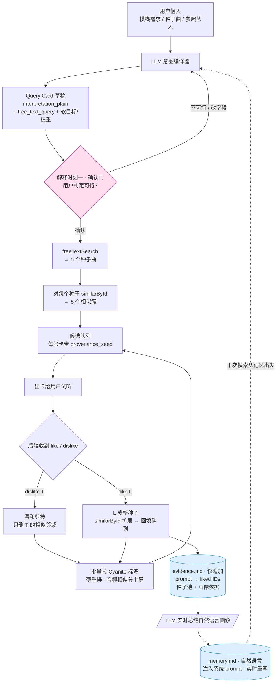

# Cochlea — 夜晚版 PRD（一晚冲刺）

> 后端 only · audio-first · 分支剪枝式探索 + 双消费者记忆 · 基于 Cyanite API

---

## 0. 这版和 24h 全量 PRD 的差异

| 变化点 | 旧（PRD.md） | 新（本版） |
|--------|-------------|-----------|
| **硬过滤** | tag 硬约束（纯器乐/BPM 上限） | **删除**。Query Card 只剩解释 + freeText 查询 + 软目标/权重 |
| **Query Card** | 可改，但流程没明确停 | **加人工确认门**：出卡 → 停 → 用户判定可行/修改 → 才往下走 |
| **检索起点** | freeText ⊕ similarById 一把召回 | freeText 出 **5 个种子** → 每个种子 similarById **扩成 5 个簇** |
| **反馈机制** | 左右滑写记忆 | **邻域剪枝**：踩一首 → 删它的相似邻域；赞一首 → 该曲成新种子扩展回填 |
| **反馈去向** | 两个消费者（种子 + 参数）混在一起 | **两份 markdown 都持久化**：证据库 `evidence.md`（prompt→liked IDs，仅追加，当种子池 + 画像依据） + 记忆画像 `memory.md`（**自然语言**，LLM 从证据实时重写后注入 prompt） |
| **持久化介质** | SQLite | **删除 DB**。会话状态留内存 dict；跨会话记忆 = 两个 markdown 文件（可解释、现场可打开） |
| **前端** | Tinder 卡交互 | **不做**。后端收 like/dislike 信号即可 |

---

## 1. 完整文字版 Workflow

**① 输入 → 意图编译**
用户给一句模糊需求、一首种子曲、或一个参照艺人名字。LLM 把它编译成一张可见、可编辑的 **Query Card**，含一句大白话 `interpretation_plain`（"我把你的需求理解成这样"）。**这是第一个解释时刻。**

**② 确认门（停一下）**
系统在这里**停住**，把 Query Card 交还给用户判定：可行就确认；不可行就修改需求或直接改卡里的字段，回到 ① 重新编译。**没确认不往下走。**

**③ 种子搜索**
Query Card 确认后，跑 `freeTextSearch`（把语言打进音频空间），返回约 **5 个种子曲**。

**④ 簇扩展**
对这 5 个种子各跑 `similarById`，每个种子拉出一簇声学相似曲，合成候选队列。**每个候选都打上 `provenance_seed`**（它是从哪个种子分支长出来的），后面剪枝靠它。

**⑤ 出卡 + 收反馈（后端循环）**
候选逐张给用户试听，用户对每首回 like / dislike：
- **dislike T** → 只把 **T 的相似邻域**（T 自己那一圈 `similarById`）从队列里移除，**温和剪枝**，不波及整条分支。
- **like L** → L 成为**新种子**，对 L 跑 `similarById` 把它的相似曲**回填**进队列，这条方向继续生长。

效果上是一次**沿音频相似图的偏好制导探索**：踩到的局部邻域收缩，赞中的方向扩张。

**⑥ 薄重排**
拿到用户**喜欢的 ID** 后，批量拉取这些曲的 Cyanite 标签，对当前队列做**薄重排**——**音频相似分始终是主导信号**，标签软目标只做轻微调序。重排后回到 ⑤ 继续出卡。

**⑦ 反馈的两个去向（两个 markdown 都持久化 —— 本版核心）**
- **证据库 `evidence.md`（持久化 · 原始层 · 仅追加）**：记录"用户发某条 prompt 时，喜欢了哪些曲目 ID"，即 `(prompt, liked_track_ids[], ts)`。它有双重身份——本次会话当 `similarById` 的**种子池**做渐进式披露喂卡；跨会话累积成**用户画像的原始依据**。喜欢一首就 append 一行，**不抛弃、不改旧行**。
- **记忆画像 `memory.md`（持久化 · 派生层 · 实时重写）**：把该用户的 `evidence.md` 喂 LLM，**总结成一段自然语言画像**（"你偏爱黑暗、克制的电子质感，排斥明亮抒情；场景多是深夜独处"），**整段重写、注入系统 prompt**。它是证据的派生物，丢了能从 `evidence.md` 重建。下次编译 Query Card 时带着它。
  - `# ponytail: prefs 不做结构化 schema，自然语言即可——LLM 母语，注入 prompt 不用翻译，演示直接念给人听`

**⑧ 闭环**
下一次搜索**从记忆出发**（系统 prompt 已带着这个用户的参数偏好去编译 Query Card），推荐越来越贴近他的品味，回到 ①。

> 一句话：**喜欢的 ID 既当本会话的探索种子，也追加进 `evidence.md` 当画像证据；再由 LLM 从证据实时总结出自然语言画像 `memory.md` 注入 prompt。** 证据层细粒度仅追加、画像层自然语言实时重写，两个 markdown 都持久化。

---

## 2. 流程图版 Workflow



---

## 3. 后端组件 + 数据契约（接口先冻死）

四个端点，三套 JSON，两个 markdown 文件。无数据库。前端不做，这些就是"接缝"。

**Query Card（无硬过滤）**
```json
{
  "interpretation_plain": "我把'背叛'理解成黑暗、压抑、克制",
  "free_text_query": "dark tense restrained betrayal cinematic",
  "soft_targets": [{"dim": "mood", "value": "dark", "weight": 0.6}],
  "negatives": [{"dim": "mood", "value": "uplifting"}]
}
```

**端点**

| 端点 | 入 | 出 | 干什么 |
|------|----|----|--------|
| `POST /intent` | `{text}` | Query Card 草稿 | LLM 编译，**带记忆里的参数偏好**做 prompt |
| `POST /intent/confirm` | 编辑后的 Query Card | `{session_id, cards[]}` | 过确认门 → freeText 出 5 种子 → 簇扩展 → 首批候选 |
| `POST /feedback` | `{session_id, track_id, verdict}` | `{cards[]}` | 剪枝 / 回填 / 薄重排后的下一批 |
| `GET /your-sound` | `{session_id}` | 记忆摘要 | 可选，演"越用越准" |

**会话状态（内存 dict，会话结束就扔，不落盘）**
```
session: id, user_id, query_card,
         queue[]   // 每项: track_id, provenance_seed, audio_score
         pruned_tracks{}    // 被踩曲的相似邻域，已从队列剔除
```
`# ponytail: 会话状态全在内存，不上 DB、不落盘——剪枝/回填要精确 track_id 集合，dict 最顺`

**跨会话记忆（两个 markdown 文件，无 DB）**
```
memory/<user_id>.evidence.md   // 仅追加，原始事实，唯一真相
    ## 反馈记录
    - 「背叛」→ liked t1, t7   (ts)

memory/<user_id>.memory.md     // LLM 实时重写，自然语言画像，证据的派生物
    ## 你的声音
    你偏爱黑暗、克制的电子质感，排斥明亮抒情；场景多是深夜独处。
```
- 写 evidence：`/feedback` 点赞 → append 一行，从不改旧行。
- 写 memory：`/feedback` 后把 evidence 喂 LLM → **整段重写** memory.md（实时进化）。
- 读：`/intent` 把 memory.md **原样塞进系统 prompt**，LLM 直接读，不解析。
- `# ponytail: markdown 当记忆=agent memory 标准做法。只追加 + 喂 LLM，永不解析回结构，所以不用 DB/JSON。嫌每次反馈都调 LLM，就退成 /intent 时才重算 memory`

**剪枝/回填逻辑（核心，留一个 assert 自检即可）**
- dislike T → 从 `queue` 删掉 **T 的相似邻域**（`similarById(T)` 命中的那些 + T 本身）。
  - `# ponytail: 温和剪枝（局部邻域）。想更狠就按 provenance_seed 砍整分支，加个 knob`
- like L → `similarById(L)` 结果灌入 `queue`，标 `provenance_seed = L`；L append 进 `evidence.md`（当前 prompt 下的 liked 列表）+ 当本会话种子；随后 LLM 重写 `memory.md`。
- 薄重排：`score = w_audio * audio_sim(to liked) + w_soft * tag_match − w_neg * neg_match`，护栏 `w_audio > w_soft + w_neg`（**无硬过滤，负向只扣分不剔除**）。

---

## 4. 一晚时间块（约 7h + 1h buffer）

| 块 | 时间 | 干什么 | 立住的标志 |
|----|------|--------|-----------|
| **B0** | 0:00–0:30 | 冻 3 个 JSON 契约 + 两个 markdown 文件格式；Cyanite 凭证连通 | freeText / similarById 各打通一发 |
| **B1** | 0:30–2:00 | `/intent` + `/intent/confirm`：意图编译 + Query Card + **确认门** | 一句话 → 卡 → 改一处 → 卡变 |
| **B2** | 2:00–3:30 | freeText 出 5 种子 + 簇扩展 + 首批候选带 provenance | `/intent/confirm` 返回带来源的候选队列 |
| **B3** | 3:30–5:30 | `/feedback`：**剪枝 + 回填 + 薄重排** | 踩一首→整簇消失；赞一首→相似回填 |
| **B4** | 5:30–7:00 | 双消费者拆分：会话队列(内存) vs 记忆(evidence.md 追加 + memory.md 重写) + 闭环 | 新会话读 memory.md，Query Card 已带"你的声音" |
| **Buf** | 7:00–8:00 | demo 脚本 + 写死输入 + 全程走缓存 | 现场不连真 API 也能跑 |

**落后从下往上砍**：闭环持久化 → 薄重排 → 簇扩展降成"只 freeText 5 首"。
**永不砍**：确认门 + 剪枝/回填 这条主循环（这是和"Excel 检索"的本质区别）。

---

## 5. 验收 / Demo

1. **确认门成立**：输入一句话 → 看到 Query Card → 说"理解错了" → 改 → 卡和后续结果都变。
2. **分支剪枝可演**：踩掉一首民谣 → 那一簇民谣方向当场从队列消失；赞一首电子 → 电子相似曲补进来。
3. **两层记忆都落盘且可现场打开**：喜欢一首 → `evidence.md` 当场 append 一行 `(prompt, liked_id)`，且 `memory.md` 那段自然语言画像**实时变一句**；这份证据既喂当前卡流，又被 LLM 总结成画像，**新开会话**时 Query Card 自带"你的声音"。演示时直接 `cat` 这两个 md 给评委看。
4. **可解释**（沿用全量 PRD）：每条通俗理由都指回 Cyanite 真实标签，幻觉率 ≈ 0。

---

## 6. 范围外

前端 / Tinder 卡 UI、协同过滤与热度、模型训练微调、多租户与计费、概念级对话微调、形状 sparkline。
