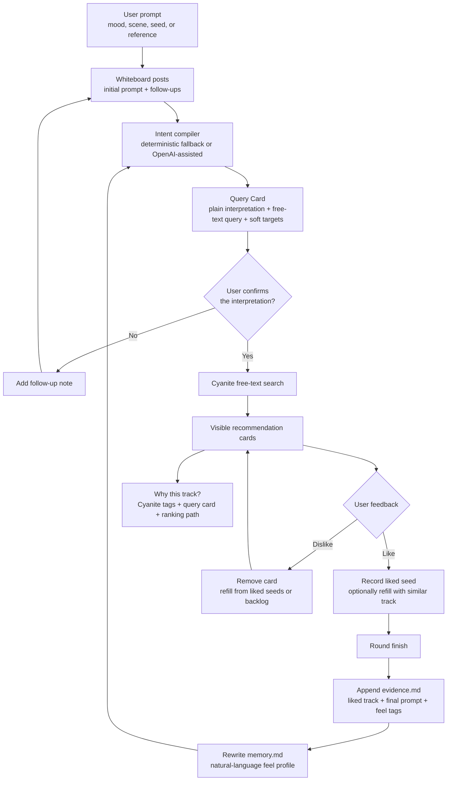
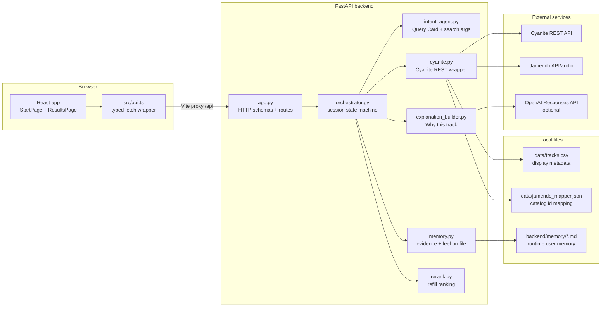

<div align="center">

# Sounds Like You

**An audio-first music discovery demo for HACKATUNE 2026**

Turn a listener's messy natural-language mood into explainable recommendations,
grounded in Cyanite audio intelligence and refined through lightweight taste memory.

[](backend/README.md)
[](frontend/README.md)
[](backend/pyproject.toml)
[](LICENSE)

[How it works](#-how-it-works) · [Architecture](#-architecture) · [Dependencies](#-dependencies) · [Run](#-run-locally) · [API](#-api-surface) · [Verification](#-verification)

</div>

---

## ✨ What is this?

Cochlea, also described in the product as **Sounds Like You**, is a hackathon music
recommendation app built around one principle: the user should understand why a
song was recommended.

The app takes a vague prompt such as "lonely midnight train ride", compiles it into
a visible Query Card, asks the user to confirm or refine that interpretation, then
searches Cyanite's audio catalog. User feedback updates an in-session seed set and,
when the round is finished, appends evidence to markdown-based taste memory.

This repository currently contains:

| Content | Description |
|---|---|
| [`frontend/`](frontend/) | React + TypeScript + Vite experience for prompt input, results, feedback, explanations, and "sounds like you" cards |
| [`backend/`](backend/) | FastAPI service that owns sessions, intent compilation, Cyanite calls, explanations, and markdown memory |
| [`data/`](data/) | Hackathon data pack: user taste profiles, Jamendo track metadata, and Cyanite/Jamendo mapping |
| [`guides/`](guides/) | Cyanite API PDFs, model-output notes, and tag vocabulary references |
| [`notebooks/`](notebooks/) | Starter notebook for Cyanite model outputs and search endpoints |
| [`PRD-night.md`](PRD-night.md) | One-night sprint PRD that defines the confirmation gate, feedback loop, and no-database memory model |
| [`GETTING_STARTED.md`](GETTING_STARTED.md) | Chinese setup guide used by the team during development |

---

## 🧭 How it works



The recommendation loop is intentionally small:

| Step | What happens |
|---|---|
| **Intent** | `/intent` stores the first prompt as a whiteboard post and compiles a Query Card without searching yet |
| **Refine** | `/intent/follow-up` adds another post and recompiles the Query Card |
| **Confirm** | `/intent/confirm` runs Cyanite free-text search only after the user accepts the interpretation |
| **Feedback** | `/feedback` records likes as seeds, removes disliked cards, and refills empty slots |
| **Memory** | `/round/finish` appends evidence and rewrites a feel-only profile in markdown |
| **Explain** | `/explain` builds an English explanation from Cyanite tags, the Query Card, user memory, and ranking metadata |

---

## 🏗️ Architecture



Session state lives in memory inside the backend process. Cross-session taste memory is
stored as two markdown files per user under `backend/memory/`; there is no database.

---

## 📁 Project structure

```text
.
├── backend/
│   ├── app.py                 # FastAPI routes and request/response contracts
│   ├── orchestrator.py        # prompt -> search -> feedback -> memory loop
│   ├── cyanite.py             # the only module that talks to Cyanite REST
│   ├── intent_agent.py        # Query Card and search-argument generation
│   ├── explanation_builder.py # grounded English recommendation explanations
│   ├── memory.py              # markdown evidence/profile storage
│   ├── rerank.py              # refill candidate ranking helpers
│   └── test_*.py              # focused backend tests
├── frontend/
│   ├── src/App.tsx            # route shell
│   ├── src/pages/             # start and results flows
│   ├── src/components/        # cards, controls, modal, visual effects
│   └── src/api.ts             # typed API client for the FastAPI backend
├── data/                      # hackathon data pack and id mapping
├── guides/                    # Cyanite endpoint guides and vocabularies
├── notebooks/                 # Cyanite starter notebook
├── start.sh                   # one-shot full-stack dev startup
├── dev.sh                     # smaller backend/frontend startup helper
└── .env.sample                # local API-key template
```

---

## 📦 Dependencies

| Layer | Runtime / package manager | Main dependencies |
|---|---|---|
| **Backend** | Python 3.13 + [`uv`](https://docs.astral.sh/uv/) | FastAPI, Uvicorn, Requests, HTTPX, python-dotenv, pytest |
| **Frontend** | Node.js 20+ + npm | React 19, React DOM, React Router, Vite, TypeScript, Tailwind CSS, motion, OGL, oxlint |
| **Data** | Local CSV / JSON | `data/tracks.csv`, `data/users.csv`, `data/jamendo_mapper.json` |
| **External APIs** | HTTP | Cyanite REST, optional Jamendo metadata/downloads, optional OpenAI Responses API |
| **Memory** | Markdown files | `backend/memory/<user_id>.evidence.md` and `backend/memory/<user_id>.memory.md` generated at runtime |

Backend dependency versions are locked by [`backend/uv.lock`](backend/uv.lock).
Frontend dependency versions are locked by [`frontend/package-lock.json`](frontend/package-lock.json).

---

## ⚙️ Configuration

Copy the sample environment file and fill in the keys you have:

```bash
cp .env.sample .env
```

| Variable | Required? | Purpose |
|---|---:|---|
| `CYANITE_API_KEY` | Yes for search/recommendation | Authenticates requests to Cyanite |
| `CYANITE_ACCOUNT` | Event metadata | Account value issued for the challenge, if needed by the team |
| `OPENAI_API_KEY` | Optional | Enables OpenAI-assisted intent/explanation generation; deterministic fallbacks exist |
| `OPENAI_MODEL` | Optional | Defaults to the value in `.env.sample` / `backend/config.py` |
| `OPENAI_BASE_URL` | Optional | Defaults to `https://api.openai.com/v1` |
| `OPENAI_TIMEOUT` | Optional | Response timeout in seconds |
| `JAMENDO_CLIENT_ID` | Optional but useful | Lets the backend fetch display metadata and proxy high-quality downloads |

`.env` is git-ignored and is loaded from the repository root by [`backend/config.py`](backend/config.py).

---

## 🚀 Run locally

Install the base tools first:

```bash
uv --version
node --version
npm --version
```

One command starts the whole app:

```bash
./start.sh
```

It syncs backend dependencies, installs frontend dependencies, starts FastAPI on
`:8000`, and starts Vite on `:5173`.

| URL | What it is |
|---|---|
| http://localhost:5173 | Frontend app |
| http://localhost:8000 | Backend API |
| http://localhost:8000/docs | FastAPI Swagger UI |

Smaller commands are available through [`dev.sh`](dev.sh):

```bash
./dev.sh          # sync backend dependencies only
./dev.sh run      # run FastAPI on :8000
./dev.sh front    # run Vite on :5173
```

Manual equivalents:

```bash
# Backend
cd backend
uv sync
uv run uvicorn app:app --reload --port 8000
```

```bash
# Frontend
cd frontend
npm install
npm run dev
```

---

## 🔌 API surface

| Endpoint | Purpose |
|---|---|
| `GET /health` | Lightweight backend health check |
| `POST /intent` | Start a session and compile the first Query Card |
| `POST /intent/follow-up` | Add a follow-up note and recompile the Query Card |
| `POST /intent/confirm` | Run confirmed Cyanite free-text search and return cards |
| `POST /feedback` | Apply like/dislike feedback and refill the visible list |
| `POST /round/finish` | Persist liked evidence and rewrite the user feel profile |
| `POST /explain` | Generate "Why this track?" for a visible recommendation |
| `GET /your-sound` | Return the user's markdown feel profile |
| `GET /sounds-like-you` | Search for tracks that match the long-term profile |
| `POST /explain-sounds-like-you` | Explain a profile-based track |
| `GET /download/{track_id}` | Proxy a Jamendo MP3 download when enabled |
| `GET /cyanite/*` | Debug helpers for trying Cyanite calls from Swagger |

The frontend talks to these routes through Vite's `/api` proxy, so browser code uses
relative paths such as `/api/intent`.

---

## 🧪 Verification

Backend tests are offline-friendly because network modules are monkeypatched in focused
tests:

```bash
cd backend
uv run pytest
```

Frontend checks:

```bash
cd frontend
npm run build
npm run lint
```

Basic runtime smoke checks:

```bash
./start.sh
curl localhost:8000/health
```

Expected health response:

```json
{"ok":true}
```

For an end-to-end demo, open `http://localhost:5173`, enter a prompt, confirm the Query
Card, then like/dislike recommendations and open "Why this track?".

---

## 🎧 Data and API notes

The app uses two id spaces:

| Id | Meaning |
|---|---|
| `track_id` | Jamendo numeric track id, used for audio/display/download paths |
| `cyanite_id` | Cyanite library id, passed to Cyanite search, similarity, and model-output endpoints |

Cyanite calls live in [`backend/cyanite.py`](backend/cyanite.py), which wraps:

| Cyanite capability | Backend function |
|---|---|
| Text prompt search | `search_by_prompt()` |
| Single-seed similarity | `find_similar()` |
| Multi-seed similarity | `find_similar_multi()` |
| Model outputs / tags | `model_tags()` |

Jamendo metadata is used to fill missing title/artist fields when Cyanite search returns
catalog tracks outside the small seed data pack.

---

## 🧹 Maintenance

Do not commit local runtime state:

| Path | Why |
|---|---|
| `.env` | Local API keys |
| `backend/.venv/` | Local Python environment |
| `frontend/node_modules/` | Local npm install |
| `backend/memory/*.md` | Runtime user memory |
| Build caches | Generated artifacts |

Recommended pre-commit checks:

```bash
cd backend && uv run pytest
cd ../frontend && npm run build
git status --short
```

---

## Terms and licenses

- Challenge brief: [`CHALLENGE.md`](CHALLENGE.md)
- Challenge agreement: [`CHALLENGE_AGREEMENT.md`](CHALLENGE_AGREEMENT.md)
- Code and docs: MIT, see [`LICENSE`](LICENSE)
- Data pack terms: [`DATA_LICENSE.md`](DATA_LICENSE.md)

<div align="center">

Built for **HACKATUNE 2026** · Audio-first discovery with explainable recommendations

</div>
